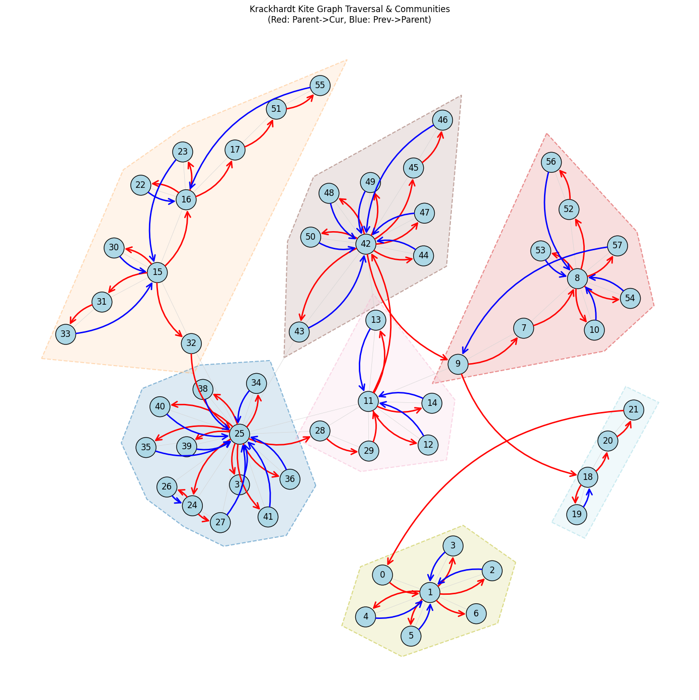

# DocuDialogue: AI-Powered Realistic Conversation Generation from Documents

DocuDialogue is an advanced system for generating realistic, multi-turn dialogues between two or more personas based on the content of your PDF documents. It leverages a sophisticated pipeline including Entity and Relationship (triplet) extraction, Knowledge Graph construction, community detection, and specialized LLM-driven dialogue generation to produce conversations that delve into detailed topics, even those only briefly mentioned in the source material. The system is designed to scale effectively with the size and number of input documents.

## Key Features

*   **PDF Document Input:** Seamlessly processes PDF files as the source of knowledge.
*   **Entity & Relationship Extraction:** Identifies key entities and their relationships (triplets) within the document.
*   **Knowledge Graph (KG) Construction:** Builds a structured KG from the extracted triplets, representing the document's core information.
*   **Community Detection:** Employs the Leiden algorithm to identify thematic clusters (communities) within the KG.
*   **Intelligent Graph Traversal:** Uses a modified Depth-First Search (DFS) algorithm to navigate the KG. This traversal is community-aware, identifying optimal entry and exit nodes for each community to ensure coherent thematic flow.
*   **Contextual LLM Dialogue Generation:** A specialized Large Language Model (LLM) generates dialogue turns. The generation is uniquely adapted based on the traversal context:
    *   **Returning to a Previous Subject:** Generates dialogue that acknowledges and builds upon prior discussion of the subject.
    *   **Switching Between Communities:** Creates natural transitions as the conversation shifts between different thematic clusters.
    *   **Switching Subjects Altogether:** Manages complete topic shifts smoothly.
*   **Detailed Topic Coverage:** Capable of generating conversations that explore nuances and details, even from briefly mentioned topics.
*   **Scalability:** Designed to handle large documents or multiple documents efficiently.
*   **Configurable Workflow:** A `config.json` file allows users to customize and control each step of the generation pipeline.

## How It Works (Workflow)

1.  **Document Ingestion & Preprocessing:** The input PDF document is parsed and prepared for analysis.
2.  **Triplet Generation:** Entities and their relationships are extracted from the text to form (subject, predicate, object) triplets.
3.  **Knowledge Graph Construction:** These triplets are used as nodes and edges to build a comprehensive Knowledge Graph.
4.  **Community Detection:** The Leiden algorithm is applied to the KG to group densely connected nodes into communities, representing distinct themes or sub-topics within the document.
5.  **Intelligent Traversal Strategy:**
    *   A modified DFS algorithm is employed to navigate the KG.
    *   The traversal prioritizes exploring within a community before moving to another.
    *   It identifies optimal "entry" and "exit" nodes when moving between communities to maintain conversational coherence.
    *   The image below illustrates an example of the graph structure with communities and potential traversal paths:
        
6.  **Contextual Dialogue Generation:**
    *   As the traversal progresses, the sequence of visited nodes (subjects) and community shifts are fed to a specialized LLM.
    *   The LLM generates dialogue turns reflecting the current traversal state:
        *   Revisiting a node (subject).
        *   Transitioning from one community (theme) to another.
        *   Jumping to a new, unrelated subject within the graph.
7.  **Output:** A realistic, multi-persona dialogue script covering diverse aspects of the input document.

## Installation

This project uses `uv` for packaging and environment management.

1.  **Prerequisites:**
    *   Python (3.9+ recommended)
    *   `uv` (Python packaging tool). If you don't have it, install it via pip:
        ```bash
        pip install uv
        ```

2.  **Clone the repository:**
    ```bash
    git clone https://github.com/leonjovanovic/docudialogue.git
    cd docudialogue
    ```

3.  **Create and activate a virtual environment using `uv`:**
    ```bash
    uv venv
    source .venv/bin/activate  # On Linux/macOS
    # .venv\Scripts\activate    # On Windows
    ```

4.  **Install dependencies:**
    If a `pyproject.toml` file is configured for the project:
    ```bash
    uv pip install -e .
    ```

## Environment Variables

Before running DocuDialogue, you need to set up environment variables for accessing the Large Language Model (LLM) API and connecting to your Neo4j database (if used as a backend for the Knowledge Graph). These variables should be placed in a `.env` file in the root directory of the project.

Create a file named `.env` in the project root and add the following, replacing the placeholder values with your actual credentials:

```dotenv
LLM_API_KEY="your_llm_api_key_here"
NEO4J_URI="your_neo4j_uri_here" # e.g., "neo4j://localhost:7687" or "neo4j+s://your_instance.databases.neo4j.io"
NEO4J_USERNAME="your_neo4j_username"
NEO4J_PASSWORD="your_neo4j_password"
```

The application will typically load these variables at startup. Ensure this `.env` file is not committed to version control if it contains sensitive information (add `.env` to your `.gitignore` file).

## Configuration

The behavior of DocuDialogue is controlled by a `config.json` file located in the root directory of the project. This file allows you to adjust parameters for each stage of the pipeline, such as:

*   Triplet extraction models or settings
*   Knowledge Graph construction parameters (e.g., whether to use Neo4j or an in-memory graph)
*   Leiden algorithm settings (e.g., resolution parameter)
*   Traversal algorithm heuristics
*   LLM model selection (which might use the `LLM_API_KEY` from your `.env` file) and prompting strategies
*   Number of personas in the dialogue
*   Output formatting options

**Before running the tool, ensure you have a `config.json` file in the project root.** You may need to copy a `config.example.json` (if provided) to `config.json` and modify it according to your needs. The settings in `config.json` will determine how the application uses the credentials provided in the `.env` file.

```json
// Example snippet of config.json (structure may vary)
{
  "pdf_processing": {
    "chunk_size": 1000
  },
  "triplet_extraction": {
    "model": "spacy_custom_rules"
  },
  "knowledge_graph": {
    "library": "networkx", // Could be "neo4j" to use Neo4j credentials
    "store_uri": "", // Potentially used if library is neo4j, or fetched from NEO4J_URI
    "username": "",  // Potentially used if library is neo4j, or fetched from NEO4J_USERNAME
    "password": ""   // Potentially used if library is neo4j, or fetched from NEO4J_PASSWORD
  },
  "community_detection": {
    "algorithm": "leiden",
    "resolution_parameter": 1.0
  },
  "traversal": {
    "max_depth": 10,
    "community_hop_penalty": 0.5
  },
  "llm_dialogue": {
    "model_provider": "openai", // or "huggingface", "local_ollama" etc. Uses LLM_API_KEY
    "model_name": "gpt-3.5-turbo",
    "temperature": 0.7,
    "max_tokens_per_turn": 150,
    "personas": ["Analyst", "Researcher"]
  },
  "output": {
    "format": "txt"
  }
}
```

## Usage / Inference

To generate a dialogue from a PDF document, you will typically run a main script from the command line.

1.  **Ensure your `.env` file is created and populated with your credentials.**
2.  **Ensure your `config.json` is properly set up.**
3.  **Activate your virtual environment** (if not already active):
    ```bash
    source .venv/bin/activate
    ```
4.  **Run the main script** TODO

## Contributing

Contributions are welcome! If you'd like to contribute, please follow these steps:

1.  Fork the repository.
2.  Create a new branch (`git checkout -b feature/your-feature-name`).
3.  Make your changes and commit them (`git commit -am 'Add some feature'`).
4.  Push to the branch (`git push origin feature/your-feature-name`).
5.  Create a new Pull Request.

Please open an issue first to discuss any significant changes.

## License

This project is licensed under the MIT License - see the `LICENSE` file for details.